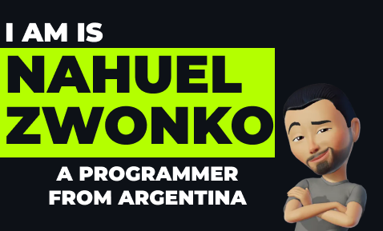

        

<!-- Rahul name gif image -->

  

<!-- for line break -->
 
     
 

<h3 align="center">let's talk a little about me</h3>
 

- 🔭 I am currently working on . **Back End development**

- 🌱 I’m currently learning **C++**

- 💬 Ask me about **DATA STRUCTURES**

- 👯 I’m looking to collaborate with some enthusiastic person

- 📫 How to reach me **nahuelzwonko22@gmail.com**

- 🎯 Goals: earn in dollar 💰 / live in a cold place ❄

- ⚡ Fun fact **I like games**
    

## 🌐 Socials:

<h3 align="left">💻 Languages and Tools:</h3>

                       
    

 
     
 

<!-- for profile counter language -->

<!-- for profile counter box -->

<!-- for line break -->
 
     
 
